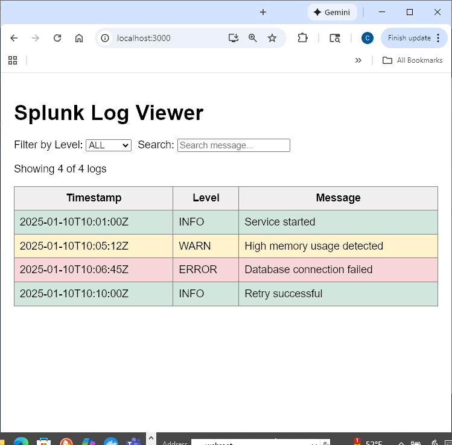
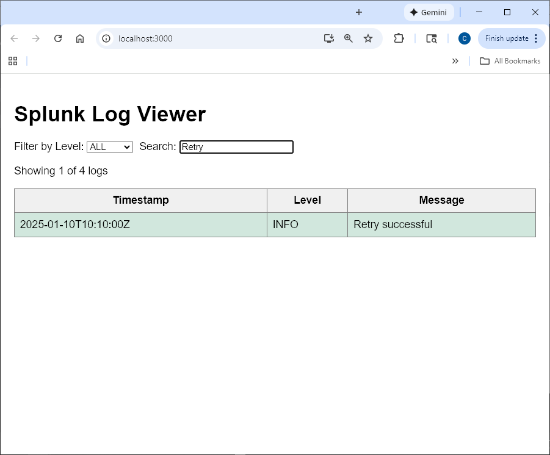
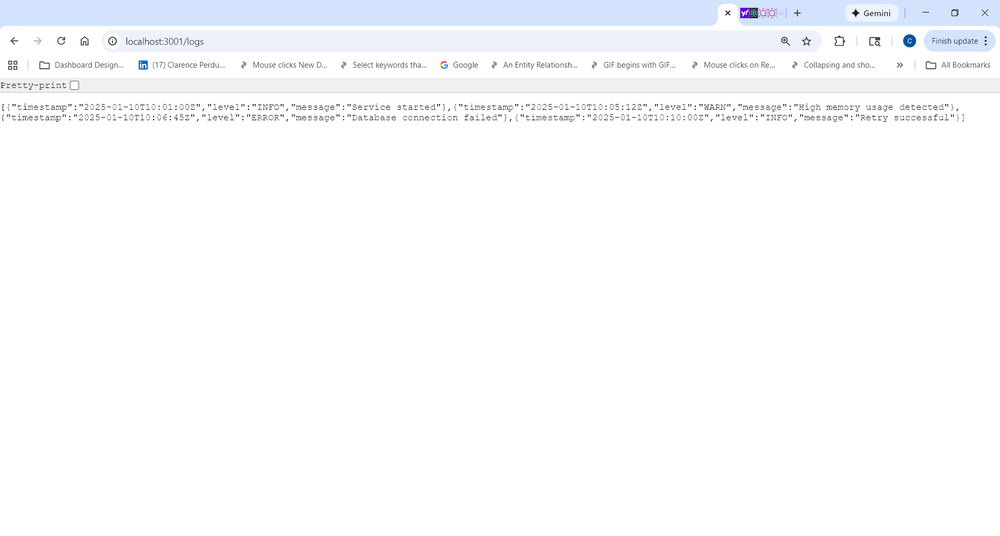

# 📊 Splunk Log Viewer (Node.js + React)

A tutorial-style, end-to-end **Splunk-inspired log viewer** built with a Node.js backend and a React frontend.

This project demonstrates **log ingestion, filtering, search, and visualization**, while intentionally documenting **real-world development issues, debugging steps, and resolutions** encountered during implementation.

> 🎯 Built as both a **working demo** and a **teaching reference** for interviews, meetups, and mentoring.

---

## 🚀 Features (v1.0 — Stable)

- Node.js + Express backend API  
- React frontend (Create React App)  
- Reads structured JSON logs from local filesystem  
- Search across **all columns** (timestamp, level, message)  
- Filter by log level (INFO / WARN / ERROR)  
- Color-coded severity levels  
- Safe CORS configuration (local dev only)  
- Clear separation of frontend and backend concerns  
- Windows-friendly setup with documented pitfalls & fixes  

---

## 📸 Screenshots

### 🔹 Main Log Viewer Interface


### 🔹 Search Across Logs


### 🔹 Backend API Running


---
## 🧠 Why This Project Exists

This project was built to:

- Demonstrate **full-stack fundamentals** (API + UI)
- Simulate **Splunk-style log exploration** in a lightweight way
- Practice **real debugging**, not just happy-path tutorials
- Provide a **step-by-step teaching artifact** showing:
  - Git & GitHub workflows
  - Windows permissions issues
  - React ↔ Node integration
  - Common setup and tooling problems with practical fixes

This is intentionally **not a black-box demo** — it’s meant to be explained.

---

## 🗂 Project Structure
```text
splunk-log-viewer/
│
├── backend/
│ ├── server.js # Express API
│ ├── logs.json # Sample log data
│ ├── package.json
│ └── package-lock.json
│
├── frontend/
│ ├── src/
│ │ └── App.js # React UI logic
│ ├── public/
│ ├── package.json
│ └── package-lock.json
│
├── .gitignore
└── README.md

```
---
## 🛠 Tech Stack

### Backend
- Node.js
- Express
- CORS (restricted to localhost)

### Frontend
- React
- Fetch API
- Basic CSS styling

### Tooling
- Git & GitHub
- npm
- Windows PowerShell

---

## 🛠 Tech Stack

### Backend
- Node.js
- Express
- CORS (restricted to localhost)

### Frontend
- React
- Fetch API
- Basic CSS styling

### Tooling
- Git & GitHub
- npm
- Windows PowerShell

---

## ▶️ How to Run the Project Locally

### 1️⃣ Start the Backend (Always First)

```bash
cd backend
npm install
npm start
```
#### Backend runs at:
```bash
http://localhost:3001
```

#### Test the API directly:
```bash
curl http://127.0.0.1:3001/logs
```

###  2️⃣ Start the Frontend

#### Open a new terminal window:
```bash
cd frontend
npm install
npm start
```

#### Frontend runs at:
```bash
http://localhost:3000/
```
---
## 🧪 Testing

This project includes frontend unit tests written with **Jest** and **React Testing Library**.

### What is Tested
- Rendering of log data fetched from the backend (mocked API)
- User interaction: filtering logs by severity level

External API calls are mocked to keep tests fast, deterministic, and independent of a running backend.

### How to Run Tests

From the frontend directory:

```bash
cd frontend
npm test
```
---
## 🔍 How the App Works (High-Level Flow)
1. React app loads in the browser
2. Frontend calls GET /logs on the backend
3.Backend reads logs.json from disk
4. JSON logs are returned via the API
5. React:
   - Displays logs in a table
   - Applies level filters
   - Applies full-text search across all fields
   - Applies severity color-coding

This mirrors the core mental model behind Splunk-style log exploration.

  ---

  ## 🐳 Docker (Optional)

A Dockerfile is included for demonstration purposes.

> Note: Docker Desktop must be running for `docker build` to work.
> In restricted or corporate environments, Docker may be unavailable.
> The application runs fully without Docker using standard npm commands.

### Build (Optional)
```bash
docker build -t splunk-log-viewer-frontend .
docker run -p 3000:3000 splunk-log-viewer-frontend
```
  ---

## ⚠️ Real Issues Encountered & Resolved

This project intentionally documents real development problems, not just success paths.

## 🪟 Windows Permission Issues

Initial development under Documents/ caused permission errors

Solution: moved project to C:\dev\

## 📦 node_modules Performance

Copying node_modules caused extreme slowdowns

Solution: excluded dependencies and regenerated with npm install

## 🧬 Nested Git Repositories (Submodule Issue)

Frontend was initially tracked as a Git submodule (mode 160000)

Solution:

- Removed nested .git

- Cleaned submodule metadata

- Re-added frontend as a normal folder

## 🧾 JSON BOM Parsing Error

Logs file contained a UTF-8 BOM character

Solution:

- Sanitized file contents before JSON.parse

## 🔐 ESLint & Antivirus Conflict

ESLint cache triggered Windows AV file-lock errors

Solution:

- Disabled ESLint for development only

- No antivirus settings were changed

These scenarios reflect real-world environments, not toy examples.

##  🔐 Security Notes

- CORS restricted to localhost origins

- No credentials or secrets stored

- .env files excluded from Git

- Safe for demos, interviews, and training use

## 📈 Future Enhancements (Planned)

- Human-readable timestamp formatting

- Highlight matched search terms

- Pagination for large log sets

- Upload custom log files

- Server-side filtering & search

- Dockerized setup

- Authentication & authorization


## 👤 Author

Clarence Perdue Jr.
Built as a hands-on learning and teaching project.


